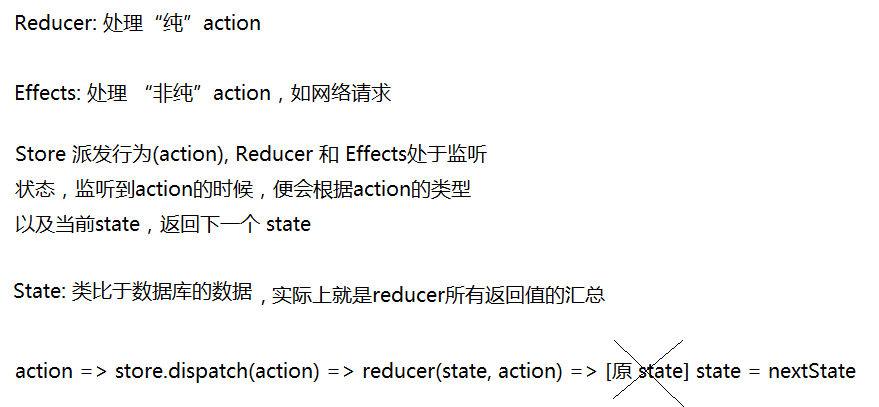
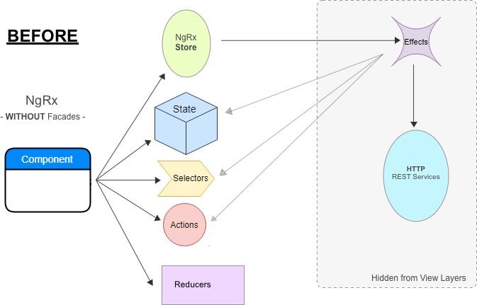
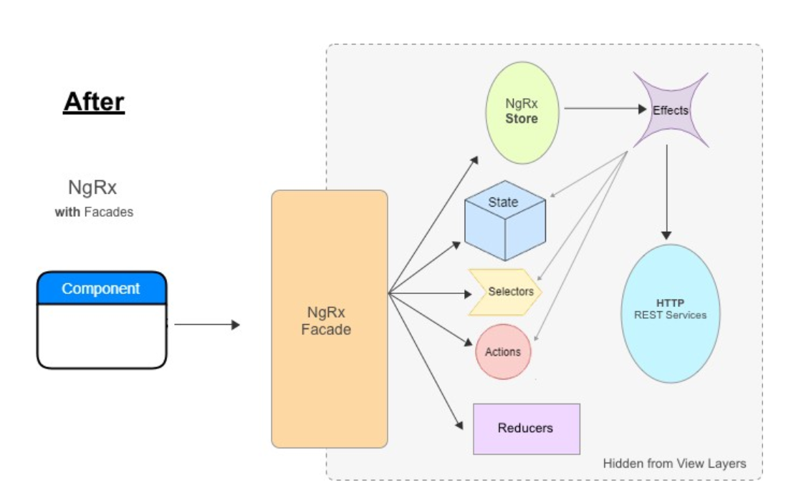

# 前提知识：
1. RxJS
2. Redux
3. TypeScript 类型、继承

## 为什么要用 Redux/Ngrx
### ⊙ 需求 1：在控制台上记录用户的每个动作

后端一般会有记录访问日志的**中间件**  
例如，在 Express 中实现一个简单的 Logger 如下：

```js
var loggerMiddleware = function(req, res, next) {
  console.log('[Logger]', req.method, req.originalUrl)
  next()
}
...
app.use(loggerMiddleware)
```

每次访问的时候，都会在控制台中留下类似下面的日志便于追踪调试：

```
[Logger] GET  /
[Logger] POST /login
[Logger] GET  /user?uid=10086
...
```

如果我们把场景转移到前端，请问该如何实现用户的动作跟踪记录？  
我们可能会这样写：

```js
/** jQuery **/
$('#loginBtn').on('click', function(e) {
  console.log('[Logger] 用户登录')
  ...
})
$('#logoutBtn').on('click', function() {
  console.log('[Logger] 用户退出登录')
  ...
})

/** MVC / MVVM 框架（这里以纯 Vue 举例） **/
methods: {
  handleLogin () {
    console.log('[Logger] 用户登录')
    ...
  },
  handleLogout () {
    console.log('[Logger] 用户退出登录')
    ...
  }
}
```

上述 jQuery 与 MV* 的写法并没有本质上的区别  
记录用户行为代码的侵入性极强，可维护性与扩展性堪忧

### ⊙ 需求 2：在上述需求的基础上，记录用户的操作时间


显然地，前端的童鞋又得一个一个去改（当然 编辑器 / IDE 都支持全局替换）：
```js
/** jQuery **/
$('#loginBtn').on('click', function(e) {
  console.log('[Logger] 用户登录', new Date())
  ...
})
$('#logoutBtn').on('click', function() {
  console.log('[Logger] 用户退出登录', new Date())
  ...
})

/** MVC / MVVM 框架（这里以 Vue 举例） **/
methods: {
  handleLogin () {
    console.log('[Logger] 用户登录', new Date())
    ...
  },
  handleLogout () {
    console.log('[Logger] 用户退出登录', new Date())
    ...
  }
}
```

而后端的童鞋只需要稍微修改一下原来的中间件即可：

```js
var loggerMiddleware = function(req, res, next) {
  console.log('[Logger]', new Date(), req.method, req.originalUrl)
  next()
}
...
app.use(loggerMiddleware)
```

### ⊙ 需求 3：正式上线的时候，把控制台中有关 Logger 的输出全部去掉
前端的童鞋又不得不乖乖地一个一个注释掉（当然也可以设置一个环境变量判断是否输出，甚至可以重写 `console.log`）

而我们后端的童鞋呢？只需要注释掉一行代码即可：`// app.use(loggerMiddleware)`，真可谓是不费吹灰之力

### ⊙ 需求 4：正式上线后，自动收集 bug，并还原出当时的场景
要完全还原出出现bug时的使用场景，几乎是不可能的。因为您不知道这个报错，用户是怎么一步一步操作得来的  

相对地，后端的报错的收集、定位以及还原却是相当简单。只要一个 API 有 bug，那无论用什么设备访问，都会得到这个 bug  
还原 bug 也是相当简单：把数据库备份导入到另一台机器，部署同样的运行环境与代码。如无意外，bug 肯定可以完美重现


### ※ 小结

为何前后端对于这类需求的处理竟然大相径庭？后端为何可以如此优雅？  
原因在于，后端具有**统一的入口**与**统一的状态管理（数据库）**，因此可以引入**中间件机制**来**统一**实现某些功能  

多年来，前端工程师忍辱负重，操着卖白粉的心，赚着买白菜的钱，一直处于程序员鄙视链的底层  
于是有大牛就把后端 MVC 的开发思维搬到前端，**将应用中所有的动作与状态都统一管理**，让一切**有据可循**
  
使用 Ngrx/Redux，借助[Store Devtools Module]/ [Redux DevTools][redux-devtools] 可以实现出“华丽如时光旅行一般的调试效果”。  
实际上就是开发调试过程中可以**撤销与重做**，并且支持应用状态的导入和导出（就像是数据库的备份）  
而且，由于可以使用日志完整记录下每个动作，因此做到像 Git 般，随时随地恢复到之前的状态
 
> 既然有了动作日志以及动作前后的状态备份，那么还原用户报错场景还会是一个难题吗？


## Store

Store中储存了应用中所有的不可变状态(state)，它是一个状态容器(state container)。ngrx/store中的store是RxJS状态(state)的**可观察对象**，以及行为(actions)的**观察者**。

**若要改变 state，必须 dispatch 一个 action**
我们可以利用Store来派发行为，派发行为时，所有的已注册 reducer 和 effects 都将监听到state的变化，它们都会收到 action。当然，我们也可以用Store的select()方法获取可观察对象，然后订阅观察，在状态变化之后做出反应。

> 区分 `Store` 和 `State`

`State` 是应用的状态，一般本质上是一个普通**对象**  
例如，我们有一个 Web APP，包含 计数器 和 待办事项 两大功能  
那么我们可以为该应用设计出对应的存储数据结构（应用初始状态）：

```js
/** 应用初始 state，本代码块记为 code-1 **/
{
  counter: 0,
  todos: []
}
```

Store一般是在构造函数中注入
```ts
  constructor(private store: Store<{ count: number }>) {
    this.count$ = store.pipe(select('count')); // count 已在 app.module中注册过
  }
```

```ts
// Store源码，可以看到它继承自Observable，并且实现了 Observer(观察者)
export declare class Store<T> extends Observable<T> implements Observer<Action> {
    select<K = any>(...paths: string[]): Observable<K>; // 获取可观察对象 
    dispatch<V extends Action = Action>(action: V): void; // 派发行为
    next(action: Action): void;
    error(err: any): void;
    complete(): void;
    ... 
}
```

## Actions
Actions are one of the main building blocks in NgRx. Actions express unique events that happen throughout your application. From user interaction with the page, external interaction through network requests, and direct interaction with device APIs, these and more events are described with actions.

Actions中的 type 是我们实现用户行为追踪的关键，和 type 对应的数据一般都会放在payload 中。

```ts
import { Action } from '@ngrx/store';

export enum ActionTypes {
    Increment = '[Counter Component] Increment',
    Decrement = '[Counter Component] Decrement',
    Reset = '[Counter Component] Reset',
}

export class Increment implements Action {
    readonly type = ActionTypes.Increment;
    
    constructor(public payload: Object) {
    }
}

export class Decrement implements Action {
    readonly type = ActionTypes.Decrement;
}

export class Reset implements Action {
    readonly type = ActionTypes.Reset;
}

export type CounterActions = Increment | Decrement | Reset
```

## Reducers
Reducers in NgRx are responsible for handling transitions from one state to the next state in your application. Reducer functions handle these transitions by determining which actions to handle based on the type.

* [pure function](https://github.com/shaw1121/blog/blob/shaw-dev/md/pure-function.md)

They produce the same output for a given input. They are **without side effects** and handle each state transition **synchronously**. Each reducer function takes the latest Action dispatched, the current state, and determines whether to return a newly modified state or the original state

* reducer and action when dispatched

When an action is dispatched, all registered reducers receive the action. Whether they handle the action is determined by the switch statement. For this reason, each switch statement always includes a default case that returns the previous state when the reducer function doesn't need to handle the action.

```ts
import { Action } from '@ngrx/store';
import { ActionTypes } from './counter.actions';

export const initialState = 0;

// Define a reducer function to handle changes in the counter value based on the provided actions.
// Reducers规定了行为对应的具体状态变化。它是纯函数，通过接收前一个状态和派发行为返回新对象作为下一个
// 状态的方式来改变状态，新对象通常用Object.assign方法和扩展语法来实现。在state的副本上进行修改操作。
export function counterReducer(state = initialState, action: Action) {
    switch (action.type) {
        case ActionTypes.Increment: 
            return state + 1;
        case ActionTypes.Decrement:
            return state - 1;
        case ActionTypes.Reset:
            return 0;
        default:
            // 由于 nextState 会把原 state 整个替换掉
            // 若无修改，必须返回原 state（否则就是 undefined）
            return state;
    }
}

```

**Meta-reducers**

Developers can think of meta-reducers as hooks into the action->reducer pipeline. Meta-reducers allow developers to pre-process actions before normal reducers are invoked.

Use the metaReducers configuration option to provide an array of meta-reducers that are composed from right to left.

Note: Meta-reducers in NgRx are similar to middleware used in Redux.

参见logger function in file app.state.ts

```ts
// logger 方法用来打印state、action， Meta-reducers
export function logger(reducer: ActionReducer<AppState>): ActionReducer<AppState> {
    return function(state: AppState, action: any): AppState {
      console.log('state', state);
      console.log('action', action);
      return reducer(state, action);
    };
}
```

## Effects
  
**Reducers** are only responsible for deciding which state transitions need to occur for a given action.

In an application there is also a need to handle impure actions, e.g. AJAX requests, in NgRx we call them **Effects**.

Effects are built on top of observable streams provided by RxJS. Effects are listeners of observable streams that continue until an error or completion occurs. 
它实际上是一个监听器，用来处理“非纯” actions。使用时只需注册在module中即可，如
```ts
EffectsModule.forRoot([MovieEffects]), // 注册 root effects
```

Effects are an RxJS powered side effect model for Store. Effects use streams to provide new sources of actions to reduce state based on external interactions such as network requests, web socket messages and time-based events.
Effects利用流来提供actions的新来源，以减少基于外部交互（如网络请求、web socket信息和基于时间的事件）的state。

Effects are where you handle tasks such as fetching data, long-running tasks that produce multiple events, and other external interactions where your components don't need explicit knowledge of these interactions.

**Key Concepts**
* Effects isolate side effects from components, allowing for more pure components that select state and dispatch actions.
* Effects are **long-running services** that listen to an observable of every action dispatched from the Store.
    长时间运行着的服务，监听从 Store 中分发的每个action
* Effects filter those actions based on the type of action they are interested in. This is done by using an operator.
* Effects perform tasks, which are synchronous or asynchronous and return a new action.
    返回一个新的action

传统上，组件通过调用服务来获取外部数据，承担着较多的责任。
Effects 与 Store结合使用时，降低了组件的责任。在大型应用中，这很重要。
Effects处理外部数据和交互，允许服务具有更少的状态，只执行与外部交互相关的任务。

> 当前理解：Effects 在获取数据后，利用 map 操作符，将数据放在 payload 中，然后将一个新的 action 放在“流”中，当需要state
> 更改时，action被派发到 Store 中，在那里action可以由reducer进行处理。也就是说，action的异步变化，用Effects进行处理，
> 但最终，state的变化还是要经过 reducer 进行处理，以返回下一个state。

例子见：
movie.effects.ts file
```ts
import { MoviesService } from '../service/movies.service';
import { Injectable } from '@angular/core';
import { Actions, Effect, ofType } from '@ngrx/effects';
import { of } from 'rxjs';
import { map, mergeMap, catchError } from 'rxjs/operators';

// An injectable Actions service that provides an observable stream
//  of all actions dispatched after the latest state has been reduced.
@Injectable()
export class MovieEffects {

  // Observable streams are decorated with metadata using the Effect decorator. The metadata is used to register 
  // the streams that are subscribed to the store. 
  // Any action returned from the effect stream is then dispatched back to the Store.
  @Effect()
  loadMovies$ = this.actions$.pipe(
      // The ofType operator takes one more action types as arguments to filter on which actions to act upon.
      ofType('[Movies Page] Load Movies'), 
      mergeMap(() => this.moviesService.getAll().pipe(
          // The MoviesService#getAll() method returns an observable that maps the movies to a new action on success, 
          // The action is dispatched to the Store where it can be handled by reducers when a state change is needed
          map(movies => ({ type: '[Movies API] Movies Loaded Success', payload: movies })),
          // return an observable of a new action that is dispatched to the Store in case an error occurs whil fetching movies
          //  The inner observable handles any errors or completions and returns a new observable so that the outer stream does not die. 
          // You still use the catchError operator to handle error events, but return an observable of a new action that is dispatched to 
          // the Store.
          catchError(() => of({type: '[Movies API] Movies Loaded Error'}))
        )
      )
  );

  constructor(
    private actions$: Actions,
    private moviesService: MoviesService,
  ) {}
}
```

```ts
// pipe操作符源码摘录，最后返回的也就是 Observable
 pipe<A, B>(op1: OperatorFunction<T, A>, op2: OperatorFunction<A, B>): Observable<B>;
```

## Selectors
Selectors are pure functions used for obtaining slices of store state. 

```ts
// selector.d.ts
// createSelector 函数源码，可看到，该函数可连接最多八个选择器，并可传入参数
export declare function createSelector<State, S1, S2, Result>(s1: Selector<State, S1>, s2: Selector<State, S2>, projector: (s1: S1, s2: S2) => Result): MemoizedSelector<State, Result>;
```
参数：Selector
```ts
// _@ngrx_store@7.3.0@@ngrx\store\src\models.d.ts
export declare type Selector<T, V> = (state: T) => V;
```

返回值：
```ts
export declare type AnyFn = (...args: any[]) => any;

export interface MemoizedSelector<State, Result> extends Selector<State, Result> {
    release(): void; // 该方法可以将memoized 值置为null，释放选择器，还可以将祖先选择器递归的释放，参见selector-example2.ts
    projector: AnyFn; // 映射函数
}
```

举例：
state/selector-example0.ts
state/selector-example1.ts
state/selector-example2.ts


## 总结



## [你可能不需要Redux](https://segmentfault.com/a/1190000006966262)


## Existd Question:
1. 类型别名不能被 extends，但是此处为何能够 extends

```ts
// _@ngrx_store@7.3.0@@ngrx\store\src\models.d.ts
export declare type SelectorWithProps<State, Props, Result> = (state: State, props: Props) => Result;
```

```ts
// _@ngrx_store@7.3.0@@ngrx\store\src\selector.d.ts
export interface MemoizedSelectorWithProps<State, Props, Result> extends SelectorWithProps<State, Props, Result> {
    release(): void;
    projector: AnyFn;
}
```

2. [flattening operators](https://medium.com/@luukgruijs/understanding-rxjs-map-mergemap-switchmap-and-concatmap-833fc1fb09ff)

当有两个Observable的时候，inner Observable and outer Observable, 这个时候，flattening 就意味着将它们压成一个Observable。

```ts
import { of, from } from 'rxjs'; 
import { map, delay } from 'rxjs/operators';

const getData = (param) => {
  return of(`retrieved new data with param ${param}`).pipe(
    delay(1000)
  )
}

from([1,2,3,4]).pipe(
  map(param => getData(param))
).subscribe(val => console.log(val);
```

## NgRx Facades

通常，是在 Component 中调用 Ngrx 的那套概念(Select, Store, dispatch actions etc.)，



外观模式将 Ngrx 的状态管理不直接暴露给 component, 而是 通过 Facade 统一暴露 Ngrx 的操作，组件只通过与 Facade 的 communicate 实现
状态的管理


参考：
[NgRx Facades: Pros and Cons](https://auth0.com/blog/ngrx-facades-pros-and-cons/#Implementing-a-Facade)
[NgRx + Facades: Better State Management](https://medium.com/@thomasburlesonIA/ngrx-facades-better-state-management-82a04b9a1e39?)

Usermanagement 和 iotdatamodelerApplication 都是用的这种模式

## [ngrx-tips-tricks](https://medium.com/angular-in-depth/ngrx-tips-tricks-69feb20a42a7#efb3)

https://medium.com/angular-in-depth/ngrx-tips-tricks-69feb20a42a7#efb3


Refer:   
https://blog.csdn.net/fen747042796/article/details/74840844   
https://egghead.io/lessons/react-redux-describing-state-changes-with-actions   
https://segmentfault.com/a/1190000006966262   
https://github.com/kenberkeley/redux-simple-tutorial

articles相关参考   
https://www.jianshu.com/p/c2d61fc76128
